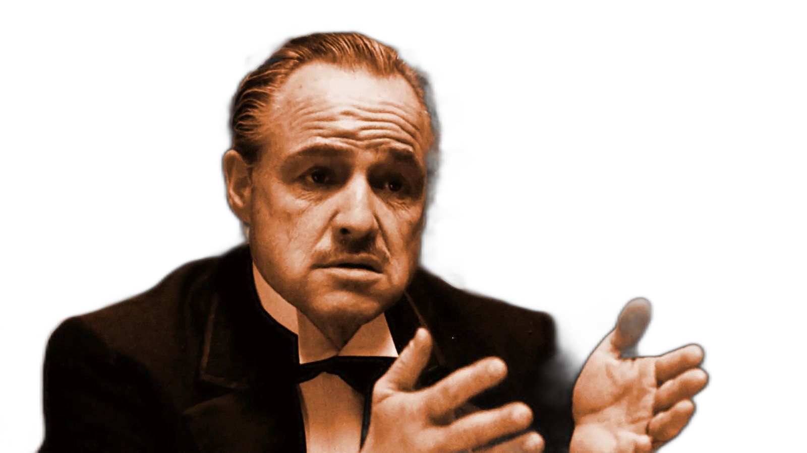

# U2Net API

[U^2-Net](https://github.com/NathanUA/U-2-Net) as a service for background removal. Using FastAPI & Pytorch.


## Examples

**Using small model on CPU (better results with larger model)**

Original | Removed
--- | ---
 | 
 | 
 | 
 | 


## Installation

* Clone the repo
* Install dependencies with `pip install -r requirements.txt`

* Optional: Download the bigger model [u2net.pth (173.6 MB)](https://drive.google.com/file/d/1ao1ovG1Qtx4b7EoskHXmi2E9rp5CHLcZ/view?usp=sharing) and set `model_name = "u2net"` inside [detect.py](detect.py)


## Usage

Run server with `python main.py`

```bash
curl -X POST -F "file=@test_image.jpg" "http://127.0.0.1:8000/predict" -o result.png
```

## Credits

https://github.com/NathanUA/U-2-Net

https://github.com/cyrildiagne/u2net-http
